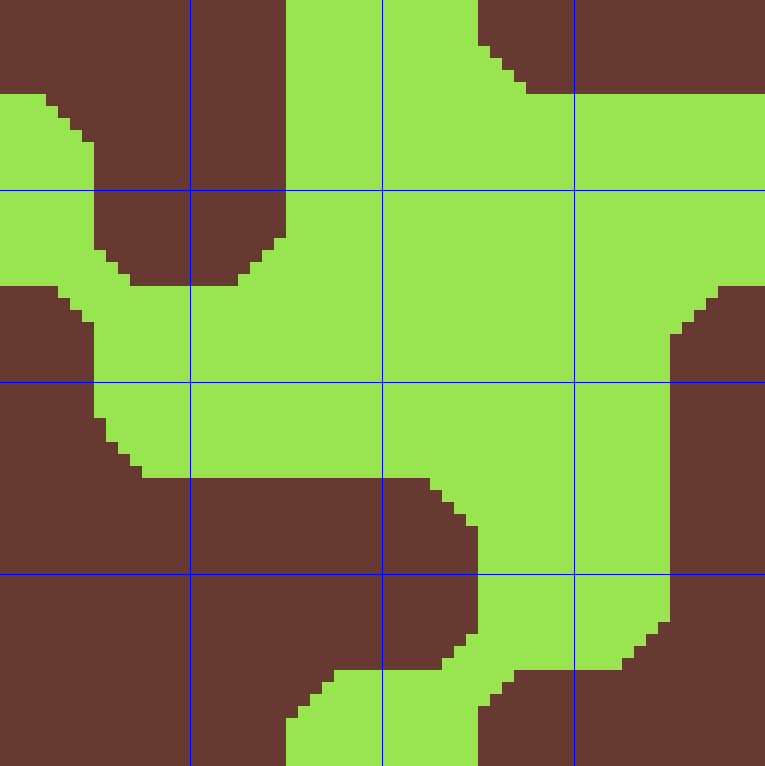
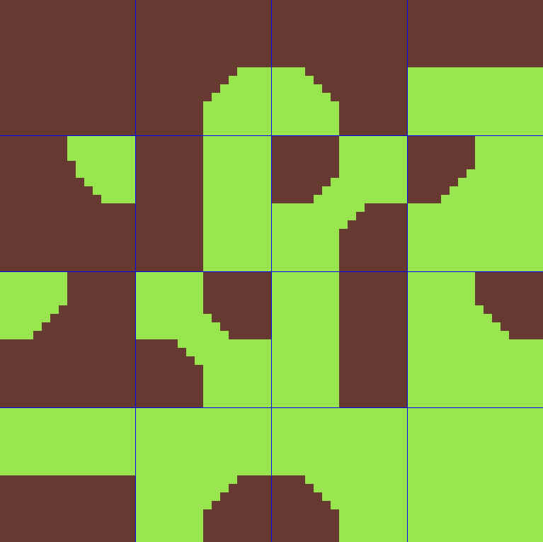

# Tilemap Bitmask Converter

A command-line tool to reorder tilemap tiles into a specific bitmask layout. Supports PNG and JPG output,         
configurable tile size, border, and spacing via a config file.

## About

This converter works for 4x4 grid tilemaps. It works best for dual grid tilemaps — for more information watch the 
talk from [Oskar Stålberg](https://www.youtube.com/watch?v=Uxeo9c-PX-w&t=308s).

If you use bitmask logic to place tiles in your game, this tool can save you from manually reordering your        
tilemap. Note that you will need to adapt your masking logic to match the converted layout.

## Conversion Layout
```
Input:              Output:
01 02 03 04    →    13 14 01 04
05 06 07 08    →    09 02 15 06
09 10 11 12    →    16 05 12 03
13 14 15 16    →    10 08 11 07
```

Layout_example: <br>
 => 

 => 

## Usage

./tilemap-converter input.png [output.png]

If no output filename is provided, the output will be saved as `input_mask.png` (or your configured format).

## Config

Edit `config.ini` before running:

```ini
//for Input file
tile_width  = 16    //tile width in pixels
tile_height = 16    //tile height in pixels
border      = 0     //outer border in pixels
spacing     = 0     //spacing between tiles in pixels

//for Output file
output_border   = 0 //outer border
output_spacing  = 0 //spacing between tiles
output_format   = png //png or jpg

Building

gcc main.c -lm -o tilemap-converter

Pre-built binaries for Linux, macOS, and Windows are available on the ../../releases page.

Credits

- https://github.com/nothings/stb by Sean Barrett — public domain image loading and writing
